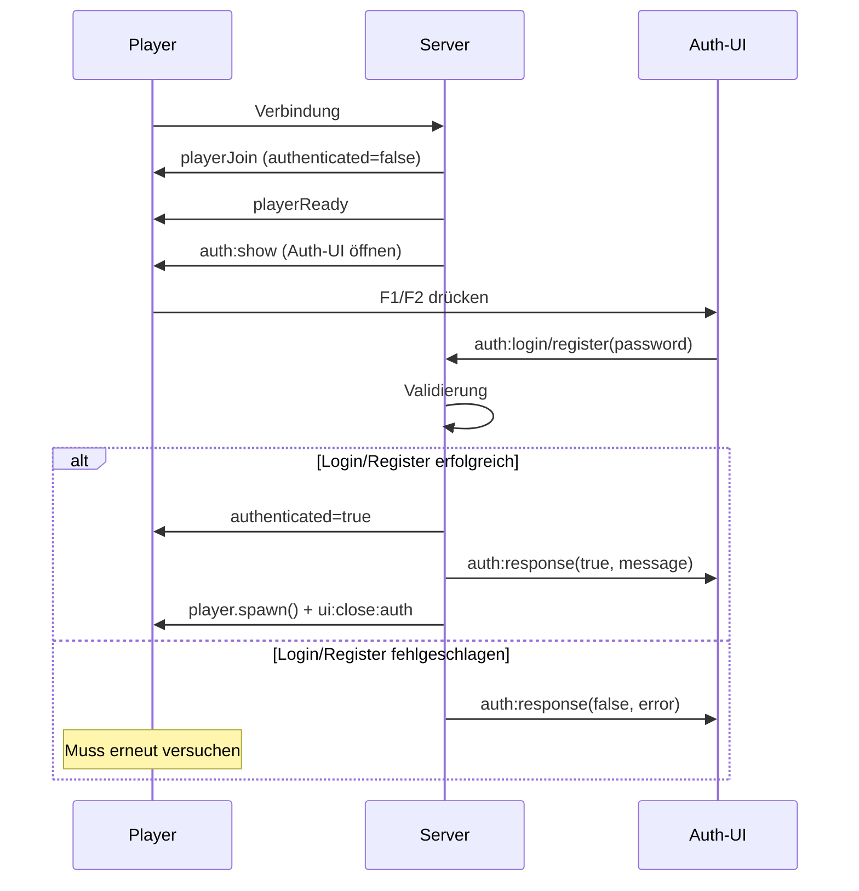
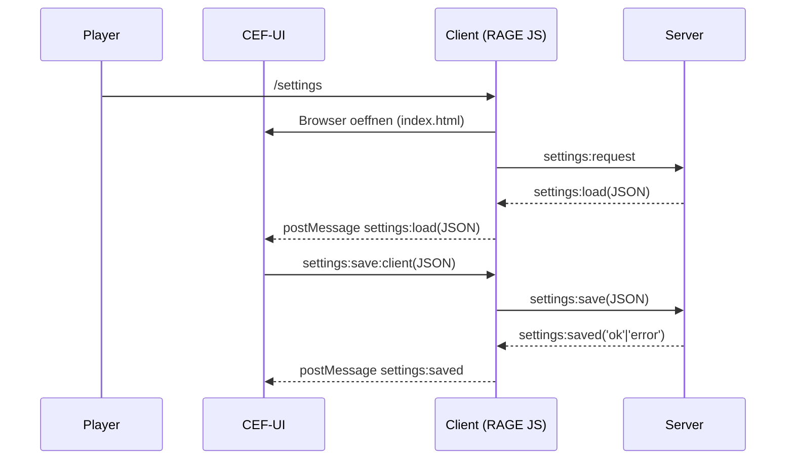
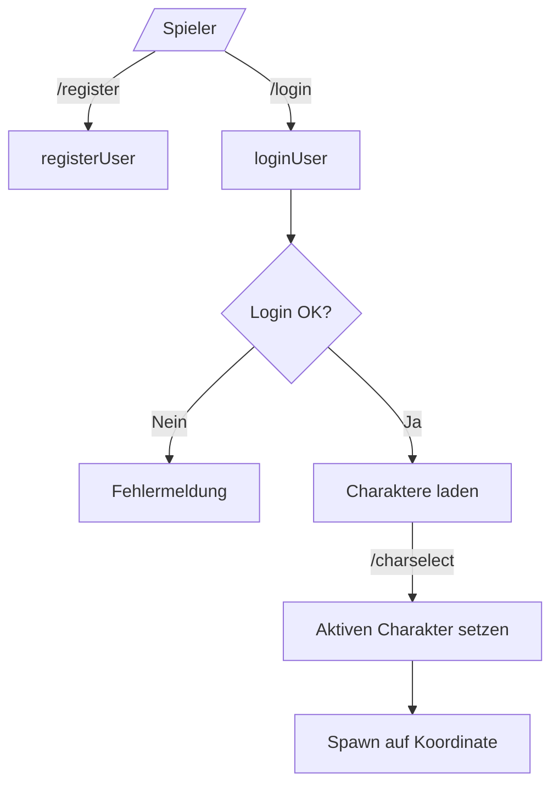
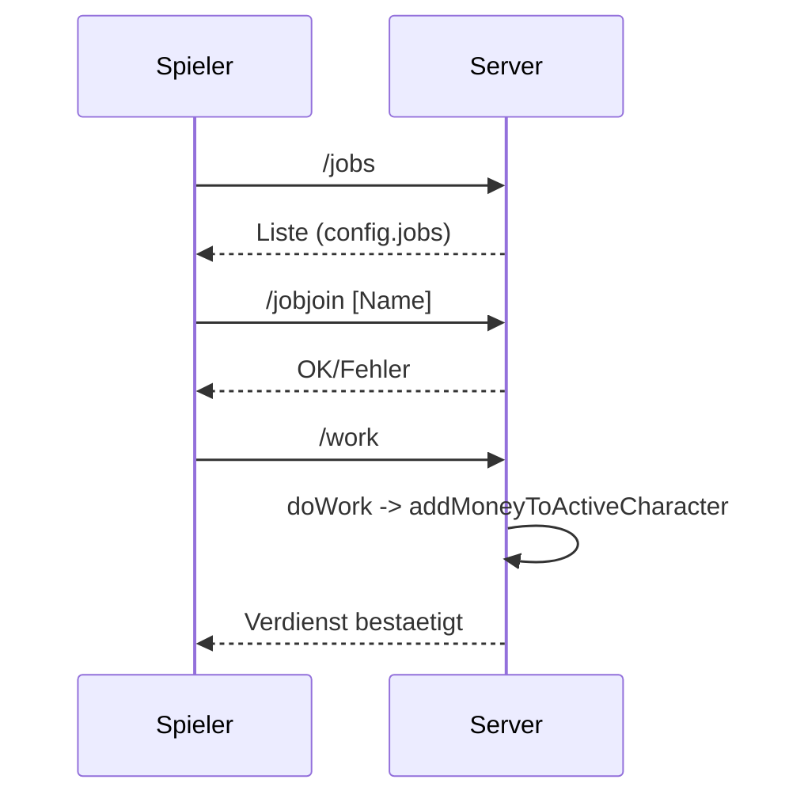
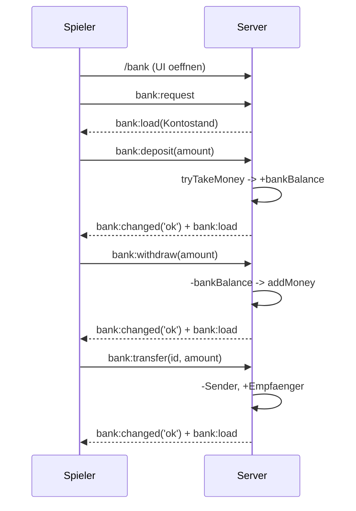
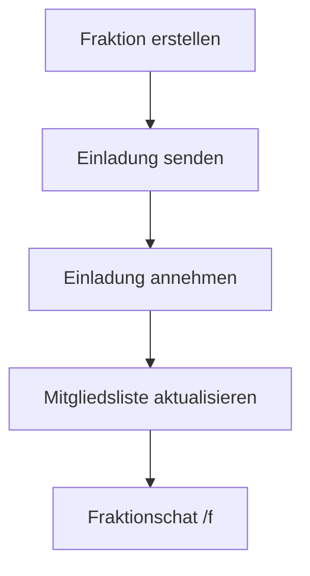
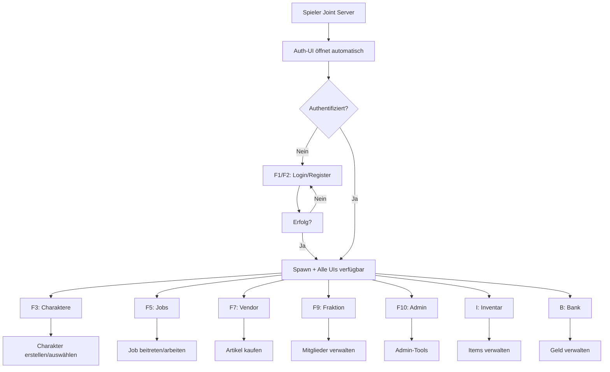
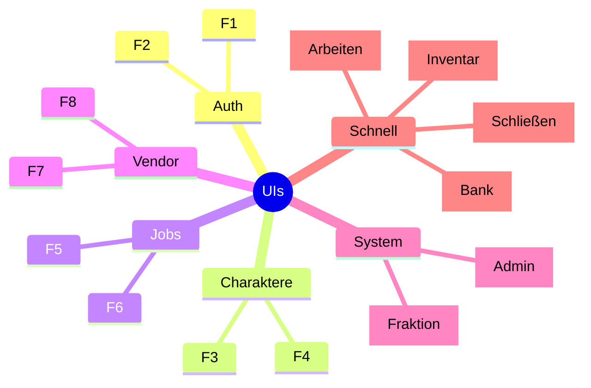

# Diagramme – Kern-Flows

## Authentifizierung vor Spawn (NEU)


## Settings (CEF) – Client/Server Interaktion


## Auth + Charaktere + Spawn


## Job – Beitritt und Arbeit


## Haendler – Kaufprozess
```mermaid
flowchart LR
  A[/Spieler/] -->|/vendor [Name]| V[Vendor Items]
  A -->|/buy [Vendor] [Item] [Menge]| B{Genug Geld?}
  B -- Nein --> N[Abbruch/Info]
  B -- Ja --> T[tryTakeMoney]
  T --> C[Kauf bestaetigen]
```

## Banking – Ein-/Auszahlen/Ueberweisen


## Fraktion – Einladen/Beitreten/Chat


## UI-System Übersicht (NEU)


## Tastenkombinationen-Map


**Hinweis**: Diese Diagramme spiegeln die aktuelle Implementierung wider (Events, Services, Konfiguration in `config/default.json`).
